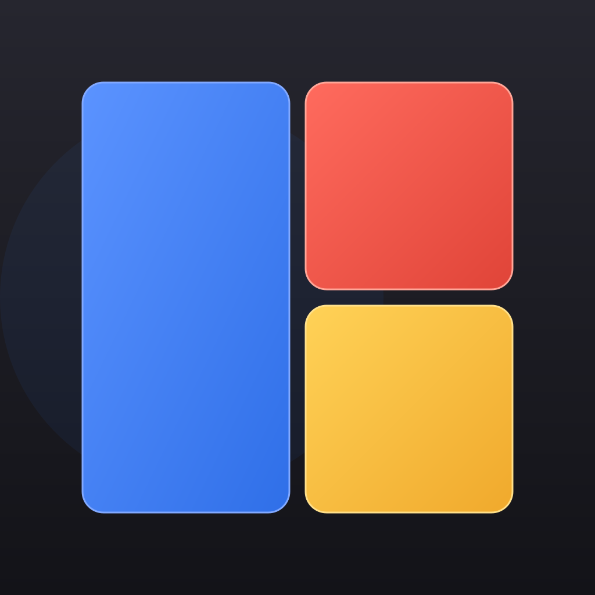
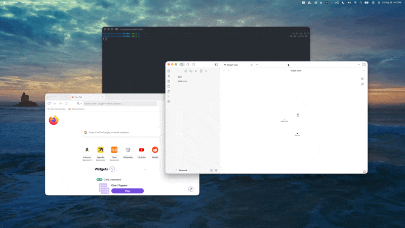

<div align="center">



# Vindue

**Free, open-source grid window tiling for macOS — the Divvy drag-a-grid interaction, programmable by you or AI.**

[](https://github.com/msukmanowsky/vindue/actions/workflows/ci.yml)
[](LICENSE)

[Docs](https://vindue.app/) · [Roadmap](https://vindue.app/docs/roadmap) · [Changelog](CHANGELOG.md)

</div>

<div align="center">



<sub>**[▶ Watch the 3-minute tour](https://www.youtube.com/watch?v=jSGT-9tCG1A)**</sub>

</div>

An open-source menu-bar tiler built with Tauri 2 + React/TS. ("Divvy" is a
Mizage trademark; this project is unaffiliated.)

## What it does

1. Focus any window, on any display
2. Left-click the menu-bar icon (or an optional global hotkey — none by
   default) → a 6×6 grid panel appears **on every display**, centered and
   sized to that display's aspect ratio, with the target window **outlined in
   blue** and the app's icon + name in the header
3. Drag across cells → the window moves/resizes to that region; the panel
   auto-dismisses (**Esc** cancels)

Panels are true modals: clicking away dismisses them, the outline follows the
target live, and the header retargets another app without dismissing.

- **Shortcuts** — save any drag to a key (color-coded, hover to preview);
  pinned to a display or relative → [docs](https://vindue.app/docs/guide/shortcuts)
- **Multi-monitor** — canonical display labels (positional suffixes for
  identical twins); display-bound shortcuts → [docs](https://vindue.app/docs/guide/multi-monitor)
- **Settings** — schema-validated form + raw-JSON views of config.json; grid
  resizes rescale saved shortcuts proportionally → [docs](https://vindue.app/docs/guide/settings)
- **Programmable by you or AI** — loopback HTTP API and an MCP server on one
  port (below)

## Install

Universal (Apple Silicon + Intel) dmgs on the **[Releases page](https://github.com/msukmanowsky/vindue/releases)**.

Every release carries two independent proofs:

```sh
shasum -a 256 Vindue_x.y.z_universal.dmg                      # must match the SHA256SUMS.txt asset
gh attestation verify Vindue_x.y.z_universal.dmg --owner msukmanowsky   # SLSA provenance: exact commit + this repo's CI identity
```

Release builds are MIT-licensed — and you can always build the tagged commit
yourself. They are **not** Apple Developer ID-signed yet: on first launch
macOS will call the app unidentified — open System Settings → Privacy &
Security → **Open Anyway** (once per release; signing + notarization are
[on the roadmap](https://vindue.app/docs/roadmap)).
Details: [Verifying your download](https://vindue.app/docs/getting-started/quickstart).

### Accessibility permission

Moving other apps' windows uses the macOS Accessibility API — grant it once
per signing identity (while releases stay unsigned, each update gets a fresh
ad-hoc identity, so expect a quick re-grant after updating). The panel shows
exactly which file needs the grant and detects it automatically:
[setup guide](https://vindue.app/docs/getting-started/quickstart) ·
[troubleshooting](https://vindue.app/docs/troubleshooting)
(incl. `AXError -25211` and coexisting with macOS's own tiling).

## Run from source

```sh
npm install
npm run tauri dev                # development
npm run tauri build -- --debug   # or build the .app
```

Requirements and the contributor guide: [CONTRIBUTING.md](CONTRIBUTING.md).

## HTTP API

With `api.enabled` (the default), a control API serves on
`http://127.0.0.1:47725` — REST for scripts and humans, MCP for AI clients,
one server. **No auth, by design**: loopback-only bind, `Host` allowlist
(DNS-rebinding defense), and rejection of any request carrying `Origin` or
`Sec-Fetch-Site` — browsers always attach those, curl/scripts/MCP clients
never do, so a web page you visit cannot drive your windows.
([SECURITY.md](SECURITY.md); pinned by tests in `src-tauri/src/api.rs`.)

```sh
curl -s 127.0.0.1:47725/api/v1/state | jq .
curl -s -X POST 127.0.0.1:47725/api/v1/tile -d '{"preset":"left_half"}'
```

14 endpoints — state, tile (9 presets or explicit cells), config CRUD,
shortcut CRUD, monitors, apps, target, and the server's own live OpenAPI spec
→ **[full reference](https://vindue.app/docs/reference/http-api)** ·
[scripting recipes](https://vindue.app/docs/guide/automating)

## MCP

The same server speaks the [Model Context Protocol](https://modelcontextprotocol.io)
at `/mcp` (streamable HTTP, official MCP Rust SDK) — 12 tools for Claude Code,
Claude Desktop, or any MCP client: tile windows, manage shortcuts, tune the
grid, list monitors and apps. One implementation, two protocols: every tool
delegates to the same handler functions as REST, and clients discover
everything live (`tools/list`, plus usage instructions in the `initialize`
response).

```sh
claude mcp add --transport http vindue http://127.0.0.1:47725/mcp
```

→ **[MCP reference](https://vindue.app/docs/reference/mcp)** ·
[tutorial: automate with scripts or AI](https://vindue.app/docs/guide/automating)

## Commands

```sh
npm run verify        # every gate in one word: tsc+vite, vitest, cargo fmt + clippy -D warnings + cargo test
npm run verify:all    # + docs site build
```

The pieces:

```sh
npm test          # vitest: geometry, config schema, shortcuts, hotkey rules, golden-vector fixtures (TS side)
npm run build     # tsc typecheck + vite build
cargo test        # (in src-tauri) placement math, config ports pinned to the same fixtures, API guard
```

The TS and Rust implementations of the shared logic (validation, rescale,
rect math, presets, monitor labels/resolution) are pinned to each other by
golden vectors in `fixtures/*.json` — both suites consume every case, so
drift on either side fails the build.

## Known limitations (deliberate)

- macOS only — Windows & Linux ports are on the [roadmap](https://vindue.app/docs/roadmap)
- Shortcuts are *local* (panel must be open) — *global* named shortcuts are a later phase
- No live resize-preview rect beyond the target outline (deferred; no `macOSPrivateApi`, all public APIs)
- Fullscreen-Space apps and apps that don't expose AX windows can't be resized
- Mixed-DPI multi-monitor: outline/placement are computed per-monitor but not yet torture-tested
- Monitor identity is name+index — rearranging displays in System Settings can soften a binding to index-fallback (footer flags it)
- The control API has no auth token — loopback bind + Host allowlist + browser-request rejection are the whole model (fine for local single-user; anything running as you can already do all of this)
- Config schema is single-revision (`version: 1`) — on mismatch the config reseeds to defaults; `seed_config` marks the seam where migrations will go

## Repository layout

```
src/          panel + settings UI (React/TS)
src-tauri/    native core (Rust) — everything but ax.rs is platform-neutral;
              ax.rs is the macOS seam where a Windows port would slot in
fixtures/     golden vectors shared by both test suites (vitest + cargo)
website/      docs site (Docusaurus)
design/       brand assets — icon masters + menu-bar glyph
```

## Architecture

Everything except one module (`src-tauri/src/ax.rs`, the macOS seam) is Tauri
framework and official plugins — the full framework-vs-custom breakdown lives
in the **[architecture docs](https://vindue.app/docs/architecture)**.

---

[Website & docs](https://vindue.app/) · [Contributing](CONTRIBUTING.md) · [Security](SECURITY.md) · [Changelog](CHANGELOG.md) · [Sponsor](https://github.com/sponsors/msukmanowsky)
